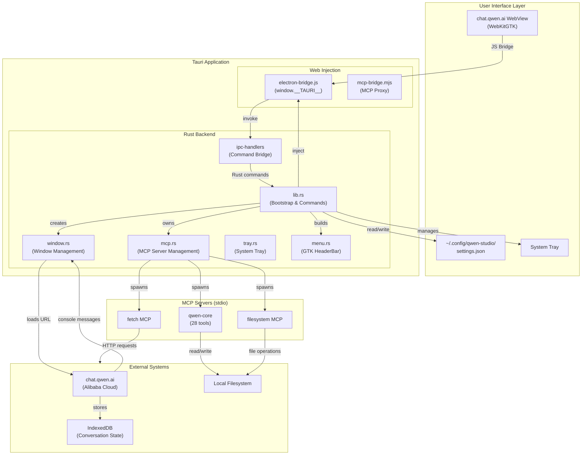
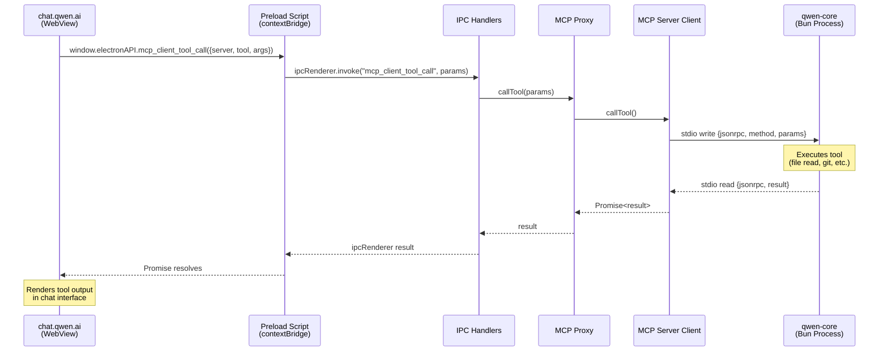
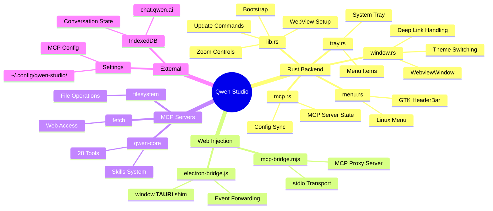
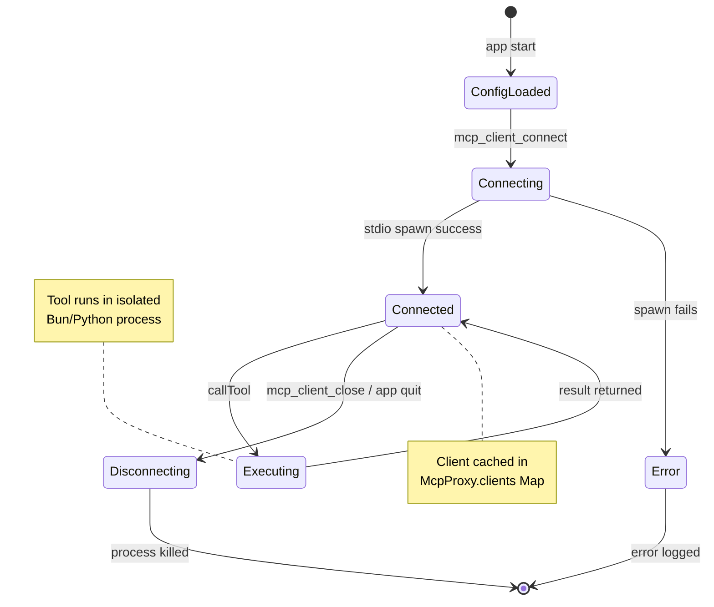
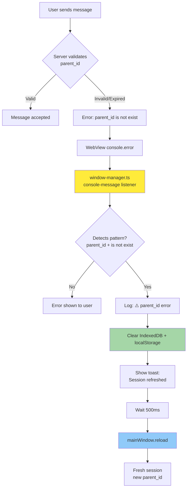
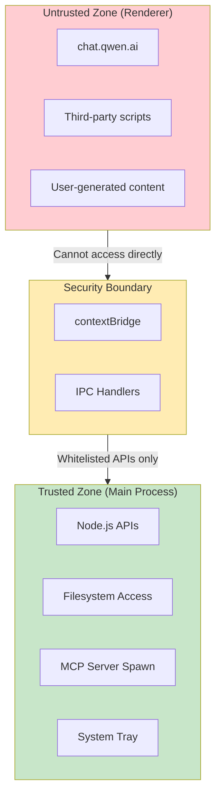

# Qwen Studio Architecture

> **Version**: 2.2.0 | **Last Updated**: 2026-05-20  
> **Stack**: Tauri v2 + WebKitGTK + Rust

## Migration from Electron (v2.2.0)

**v2.2.0** migrates from Electron to Tauri v2 for:
- **95% smaller binary**: ~6MB (Tauri) vs ~150MB (Electron)
- **Better performance**: Rust backend, native WebKitGTK WebView
- **Native Linux integration**: System tray, GTK menu, deep linking
- **Improved security**: Sandboxed WebView, no Node.js in renderer

**Key changes:**
- Main process: Node.js → Rust
- WebView: Chromium → WebKitGTK
- IPC: Electron IPC → Tauri commands (`invoke`)
- Bundling: electron-builder → Tauri bundler (RPM/DEB/AppImage)

## System Overview



## Data Flow: MCP Tool Execution



## Component Responsibilities



## Process Architecture

```mermaid
flowchart LR
    subgraph P1["Rust Backend (Main Process)"]
        M1[WebviewWindow]
        M2[MCP Manager]
        M3[Tauri Commands]
    end

    subgraph P2["Renderer (WebKitGTK)"]
        R1[chat.qwen.ai WebView]
        R2[electron-bridge.js]
        R3[Settings Tab Injection]
    end

    subgraph P3["MCP Servers (stdio)"]
        S1[qwen-core (Bun)]
        S2[fetch (Node.js)]
        S3[filesystem (Node.js)]
    end

    P1 <-->|Tauri Commands| P2
    P1 <-->|stdio JSON-RPC| P3
    
    style P1 fill:#e1f5ff
    style P2 fill:#fff4e1
    style P3 fill:#e8f5e9
```

**Changes from Electron:**
- Single Rust process replaces Node.js main process
- WebKitGTK replaces Chromium renderer
- stdio transport unchanged for MCP servers
- IPC: `ipcRenderer.invoke()` → `window.__TAURI__.core.invoke()`

## MCP Server Lifecycle



## File Structure Map

```mermaid
graph TD
    A[qwen-studio/] --> B[src/]
    A --> C[qwen-core/]
    A --> D[docs/]
    A --> E[Config Files]

    B --> B1[lib.rs - Bootstrap]
    B --> B2[main.rs - Entry]
    B --> B3[window.rs - Window Mgmt]
    B --> B4[mcp.rs - MCP State]
    B --> B5[tray.rs - System Tray]
    B --> B6[menu.rs - GTK Menu]
    B --> B7[dialogs.rs - Native Dialogs]
    B --> B8[events.rs - Event Forwarding]
    B --> B9[settings.rs - Settings Storage]

    C --> C1[src/index.ts - MCP Server]
    C --> C2[skills/ - Agent Skills]
    C --> C3[package.json]

    D --> D1[ARCHITECTURE.md]
    D --> D2[AGENT_BRAIN.md]
    D --> D3[SECURITY_AUDIT.md]

    E --> E1[tauri.conf.json]
    E --> E2[Cargo.toml]
    E --> E3[electron-bridge.js]
    E --> E4[mcp-bridge.mjs]
```



## Tauri Command Map

| Command | Handler | Purpose |
|---------|---------|---------|
| `get_update_info` | `lib.rs:804` | Check for updates |
| `install_update_with_progress` | `lib.rs:724` | Download + install |
| `restart_app` | `lib.rs:790` | Restart after update |
| `mcp_client_update_config` | `mcp.rs` | Update MCP config |
| `get_setting` | `settings.rs` | Read settings |
| `set_setting` | `settings.rs` | Write settings |
| `switch_theme` | `window.rs` | Toggle dark/light |
| `switch_ln` | `window.rs` | Change language |
| `webview_loaded` | `events.rs` | WebView ready event |

**IPC Migration:**
- Electron: `ipcRenderer.invoke('channel', args)`
- Tauri: `window.__TAURI__.core.invoke('command', args)`

## Key Design Decisions

### 1. Tauri v2 Migration (v2.2.0)
**Decision:** Migrate from Electron to Tauri v2 (Rust + WebKitGTK)

**Why:**
- 95% smaller binary (~6MB vs ~150MB)
- Better performance with Rust backend
- Native Linux system tray and menu
- Improved security (sandboxed WebView)
- Lower memory footprint

**Trade-offs:**
- WebKitGTK instead of Chromium (minor rendering differences)
- Rust learning curve for future contributors
- AppImage bundling challenges (linuxdeploy issues)

### 2. WebView Wrapper Pattern
**Decision:** Wrap chat.qwen.ai instead of building native chat UI

**Why:**
- Leverages Alibaba's continuous web app improvements
- No need to implement chat rendering, message history, account management
- Focus on desktop integration (MCP, filesystem, system tray)

**Trade-off:** Cannot modify chat UI behavior; dependent on web app stability

### 3. MCP Proxy Architecture
**Decision:** Single proxy managing multiple server connections via stdio

**Why:**
- Unified API for renderer
- Client caching reduces spawn overhead
- Lazy connection model (connect on first tool call)

**Implementation:** `mcp-bridge.mjs` - Node.js proxy server

### 4. stdio Transport for MCP
**Decision:** Use stdio JSON-RPC instead of HTTP/SSE for local servers

**Why:**
- No network overhead
- Automatic cleanup on process exit
- Simpler security model (no open ports)

**Protocol:** JSON-RPC 2.0 over stdin/stdout

### 5. qwen-core Embedding
**Decision:** Bundle qwen-core as external npm package, not inside app archive

**Why:**
- Easy updates via npm
- Version independent from app version
- Standard Node.js module resolution

**Location:** `~/.config/qwen-studio/node_modules/qwen-core`

## Error Recovery: parent_id Flow



## Build Pipeline

```mermaid
flowchart LR
    A[npm install] --> B[postinstall:<br/>download MCP runtimes]
    
    C[npm run tauri:build] --> D[cargo build --release]
    D --> E[Tauri Bundler]
    E --> F[DEB Package]
    E --> G[RPM Package]
    E --> H[AppImage (optional)]
    
    F --> I[target/release/bundle/deb/]
    G --> J[target/release/bundle/rpm/]
    H --> K[target/release/bundle/appimage/]
    
    style B fill:#ffe0b2
    style E fill:#c8e6c9
    style I fill:#bbdefb
```

**Build Commands:**
```bash
# Development (hot reload)
npm run tauri:dev

# Build all formats
npm run tauri:build

# Individual formats
npm run tauri:build:deb    # Debian/Ubuntu
npm run tauri:build:rpm    # Fedora/RHEL
```

**RPM Fix:** Uses `"compression": { "type": "none" }` to avoid `rpm-rs` gzip stall on large binaries.

## Configuration Storage

| Config | Location | Format | Managed By |
|--------|----------|--------|------------|
| MCP Servers | `~/.config/qwen-studio/settings.json` | `{ mcpServers: {...} }` | Tauri commands |
| App Theme | Web app account settings | Server-side | chat.qwen.ai |
| Language | `~/.config/qwen-studio/settings.json` | `{ app_language: "en" }` | Tauri commands |
| Conversation State | IndexedDB (LevelDB) | Binary (Leveldb) | chat.qwen.ai |
| Skills | `~/.config/qwen-studio/skills/` | Markdown files | qwen-core |

## Security Boundaries



---

**Generated:** 2026-05-20  
**Version:** qwen-studio v2.2.0 (Tauri v2)
